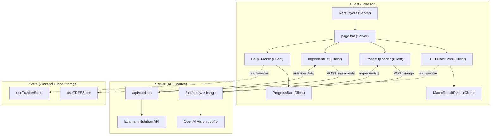

# Clinical-Grade Calorie & Macro Tracker — Implementation Plan

A production-ready calorie tracking web application built with **Next.js 16 (App Router)**, **Tailwind CSS v4**, **Zustand**, and powered by **OpenAI Vision** + **Edamam Nutrition API**.

## Current State

The workspace already has a fresh `create-next-app` scaffold with:

- Next.js 16.2.4, React 19, TypeScript
- Tailwind CSS v4 (`@import "tailwindcss"` + `@tailwindcss/postcss`)
- Zustand 5 and Lucide React already installed
- Default boilerplate page — will be replaced entirely

---

## Architecture Overview



---

## Phase 1 — Foundation: Setup, Types & State

### 1.1 Install additional dependency

> [!NOTE]
> All core deps are already installed. We only need `react-hot-toast` for notifications.

```bash
npm install react-hot-toast
```

---

### 1.2 Complete Folder Structure

```
c:\calorie-tracker\
├── app/
│   ├── layout.tsx            # [MODIFY] Root layout — dark theme, fonts, Toaster
│   ├── page.tsx              # [MODIFY] Main page — compose all feature sections
│   ├── globals.css           # [MODIFY] Design system tokens & global styles
│   ├── api/
│   │   ├── analyze-image/
│   │   │   └── route.ts      # [NEW] OpenAI Vision endpoint
│   │   └── nutrition/
│   │       └── route.ts      # [NEW] Edamam API endpoint
│   └── components/
│       ├── ui/
│       │   ├── ProgressBar.tsx    # [NEW] Animated progress bar
│       │   ├── Card.tsx           # [NEW] Glassmorphism card wrapper
│       │   └── SafetyWarning.tsx  # [NEW] BMR/1200kcal warning banner
│       ├── tdee/
│       │   ├── TDEECalculator.tsx   # [NEW] Mifflin-St Jeor form
│       │   └── MacroResultPanel.tsx # [NEW] TDEE result + macro split display
│       ├── food/
│       │   ├── ImageUploader.tsx     # [NEW] Drag & drop image upload
│       │   └── IngredientList.tsx    # [NEW] Editable ingredient table
│       └── tracker/
│           ├── DailyTracker.tsx     # [NEW] Daily log with progress bars
│           └── MealCard.tsx         # [NEW] Individual meal entry card
├── lib/
│   ├── types.ts              # [NEW] All TypeScript interfaces
│   ├── store.ts              # [NEW] Zustand stores (tracker + TDEE)
│   ├── constants.ts          # [NEW] Macro split ratios, nutrient labels
│   └── utils.ts              # [NEW] TDEE calculation, date helpers
├── .env.local                # [NEW] API keys (gitignored)
```

---

### 1.3 TypeScript Types

#### [NEW] [types.ts](file:///c:/calorie-tracker/lib/types.ts)

Define all core interfaces:

| Type            | Purpose                                                                                             |
| --------------- | --------------------------------------------------------------------------------------------------- |
| `Ingredient`    | `{ name, grams, calories, protein, fat, carbs, fiber, sugar, sodium }`                              |
| `Meal`          | `{ id, name, ingredients[], totalNutrition, portionMultiplier, timestamp }`                         |
| `DailyLog`      | `{ date (YYYY-MM-DD), meals[], totalNutrition }`                                                    |
| `UserProfile`   | `{ gender, age, weightKg, heightCm, activityLevel, goal }`                                          |
| `TDEEResult`    | `{ bmr, tdee, targetCalories, macros: { protein, carbs, fat } }`                                    |
| `NutritionInfo` | Shared shape for per-item & total nutrition (`calories, protein, fat, carbs, fiber, sugar, sodium`) |
| `ActivityLevel` | Enum: `sedentary \| light \| moderate \| active \| veryActive`                                      |
| `Goal`          | Enum: `loss \| maintenance \| gain`                                                                 |

---

### 1.4 Zustand Stores

#### [NEW] [store.ts](file:///c:/calorie-tracker/lib/store.ts)

Two stores, both with `persist` middleware (localStorage):

**`useTDEEStore`**

- `userProfile: UserProfile | null`
- `tdeeResult: TDEEResult | null`
- `setProfile(profile)` → auto-calculates TDEE + macros
- `clearProfile()`

**`useTrackerStore`**

- `dailyLogs: Record<string, DailyLog>` — keyed by date string
- `currentIngredients: Ingredient[]` — staging area before saving a meal
- `portionMultiplier: number`
- `addMeal(meal)`, `removeMeal(date, mealId)`
- `setIngredients(ingredients[])`, `updateIngredient(index, ingredient)`, `removeIngredient(index)`, `addIngredient(ingredient)`
- `setPortionMultiplier(n)` → recalculates all current ingredients
- `getTodayLog()`, `getTodayTotals()`

---

### 1.5 Utility Functions & Constants

#### [NEW] [utils.ts](file:///c:/calorie-tracker/lib/utils.ts)

- **`calculateBMR(profile)`** — Mifflin-St Jeor:
  - Male: `10 × weight(kg) + 6.25 × height(cm) - 5 × age - 161 + 166`
  - Female: `10 × weight(kg) + 6.25 × height(cm) - 5 × age - 161`
- **`calculateTDEE(bmr, activityLevel)`** — multiply by activity factor (1.2–1.9)
- **`calculateMacros(targetCalories, goal)`** — returns grams based on percentage split
- **`isBelowSafeLimit(targetCalories, bmr)`** — returns true if `< BMR` or `< 1200 kcal`
- **`formatDate(date)`**, **`getTodayKey()`**

#### [NEW] [constants.ts](file:///c:/calorie-tracker/lib/constants.ts)

- Activity level multipliers
- Macro split percentages per goal
- Nutrient labels and units

---

## Phase 2 — Backend: API Routes

### 2.1 Environment Variables

#### [NEW] .env.local

```env
OPENAI_API_KEY=sk-...
EDAMAM_APP_ID=...
EDAMAM_APP_KEY=...
```

---

### 2.2 Image Analysis API

#### [NEW] [route.ts](file:///c:/calorie-tracker/app/api/analyze-image/route.ts)

| Item           | Detail                                                                                                                  |
| -------------- | ----------------------------------------------------------------------------------------------------------------------- |
| Method         | `POST`                                                                                                                  |
| Input          | `FormData` with `image` file (or base64 JSON body)                                                                      |
| Process        | Send image to OpenAI `gpt-4o` with a nutritionist-grade prompt asking for structured JSON: `[{ name, estimatedGrams }]` |
| Output         | `{ ingredients: [{ name: string, estimatedGrams: number }] }`                                                           |
| Error handling | Validate file size (max 4MB), type (image/\*), and return structured error responses                                    |

**OpenAI Vision prompt strategy:**

```
"You are a clinical nutritionist. Analyze this food image and return a JSON array
of all visible ingredients with estimated weight in grams. Be specific (e.g.,
'chicken breast, grilled' not just 'chicken'). Format:
[{ "name": "ingredient name", "estimatedGrams": 150 }]"
```

---

### 2.3 Nutrition Lookup API

#### [NEW] [route.ts](file:///c:/calorie-tracker/app/api/nutrition/route.ts)

| Item           | Detail                                                        |
| -------------- | ------------------------------------------------------------- |
| Method         | `POST`                                                        |
| Input          | `{ ingredients: [{ name, grams }] }`                          |
| Process        | Call Edamam Nutrition Analysis API for each ingredient        |
| Output         | `{ ingredients: Ingredient[] }` with full nutrition per item  |
| Error handling | Handle Edamam rate limits, invalid food items, network errors |

Edamam endpoint: `https://api.edamam.com/api/nutrition-data` with query params `app_id`, `app_key`, `ingr` (e.g. `"150g chicken breast"`).

---

## Phase 3 — Core UI: TDEE Calculator & Macro Panel

### 3.1 Design System

#### [MODIFY] [globals.css](file:///c:/calorie-tracker/app/globals.css)

Extend Tailwind v4 with custom design tokens via `@theme inline`:

- Dark-first color palette (deep navy/charcoal backgrounds, vibrant accent gradients)
- Custom CSS variables for macro colors (protein = cyan, carbs = amber, fat = rose, fiber = emerald)
- Glassmorphism utility classes
- Smooth animation keyframes (fade-in, slide-up, pulse-glow)
- Typography scale using Geist font (already configured)

---

### 3.2 Shared UI Components

#### [NEW] [Card.tsx](file:///c:/calorie-tracker/app/components/ui/Card.tsx)

- Glassmorphism card with `backdrop-blur`, semi-transparent background
- Optional glow border effect, heading slot

#### [NEW] [ProgressBar.tsx](file:///c:/calorie-tracker/app/components/ui/ProgressBar.tsx)

- Animated fill with smooth transition
- Color prop (matches macro colors), label, current/target values
- Overflow indicator when exceeding 100%

#### [NEW] [SafetyWarning.tsx](file:///c:/calorie-tracker/app/components/ui/SafetyWarning.tsx)

- Amber/red alert banner with `AlertTriangle` icon (lucide)
- Two variants: below BMR, below 1200 kcal

---

### 3.3 TDEE Calculator

#### [NEW] [TDEECalculator.tsx](file:///c:/calorie-tracker/app/components/tdee/TDEECalculator.tsx)

`"use client"` component:

- Form fields: Gender (toggle), Age, Weight (kg), Height (cm), Activity Level (select), Goal (select)
- On submit → calls `calculateBMR` + `calculateTDEE` + `calculateMacros` from utils
- Stores result in `useTDEEStore`
- Shows `SafetyWarning` when applicable
- Premium styling: floating labels, gradient submit button, card layout

#### [NEW] [MacroResultPanel.tsx](file:///c:/calorie-tracker/app/components/tdee/MacroResultPanel.tsx)

`"use client"` component:

- Displays TDEE, BMR, Target Calories in large typography
- Macro breakdown with visual donut/arc or horizontal bars
- Color-coded: Protein (cyan), Carbs (amber), Fat (rose)
- Shows grams + percentage for each macro

---

## Phase 4 — Feature UI: Image Upload, Ingredients & Daily Tracker

### 4.1 Image Uploader

#### [NEW] [ImageUploader.tsx](file:///c:/calorie-tracker/app/components/food/ImageUploader.tsx)

`"use client"` component:

- Drag-and-drop zone with click-to-upload fallback
- Image preview with remove option
- "Analyze" button → calls `/api/analyze-image`
- Loading state with skeleton animation
- On success → auto-fetches nutrition via `/api/nutrition` → populates ingredient list
- Error toast notifications

### 4.2 Editable Ingredient List

#### [NEW] [IngredientList.tsx](file:///c:/calorie-tracker/app/components/food/IngredientList.tsx)

`"use client"` component:

- Table/card layout showing each ingredient with editable grams field
- Add new ingredient row (manual entry)
- Delete ingredient (with confirm)
- **Portion multiplier** slider/buttons (0.25x → 3x) at the top
- All values recalculate instantly on multiplier change
- Nutrition summary footer (total calories, protein, fat, carbs, fiber, sugar, sodium)
- "Save as Meal" button → pushes to `useTrackerStore`

### 4.3 Daily Tracker

#### [NEW] [DailyTracker.tsx](file:///c:/calorie-tracker/app/components/tracker/DailyTracker.tsx)

`"use client"` component:

- Date selector (defaults to today)
- Progress bars: Calories, Protein, Fat, Carbs vs. TDEE targets
- List of saved meals for the day

#### [NEW] [MealCard.tsx](file:///c:/calorie-tracker/app/components/tracker/MealCard.tsx)

`"use client"` component:

- Collapsible card showing meal name, total calories, timestamp
- Expandable to show ingredient breakdown
- Delete meal button

### 4.4 Main Page Assembly

#### [MODIFY] [page.tsx](file:///c:/calorie-tracker/app/page.tsx)

Server Component that composes all sections:

```
Header (App Title + Branding)
├── Section 1: TDEE Calculator + Macro Result Panel (side by side on desktop)
├── Section 2: Image Uploader + Ingredient List (side by side on desktop)
└── Section 3: Daily Tracker (full width)
```

#### [MODIFY] [layout.tsx](file:///c:/calorie-tracker/app/layout.tsx)

- Update metadata (title, description)
- Add `<Toaster />` from react-hot-toast
- Dark background class on `<html>`

---

## Execution Order

| Step | Phase   | What gets built                                                                                                        | Est. Files |
| ---- | ------- | ---------------------------------------------------------------------------------------------------------------------- | ---------- |
| 1    | Phase 1 | `npm install`, `.env.local`, `types.ts`, `constants.ts`, `utils.ts`, `store.ts`                                        | 5          |
| 2    | Phase 2 | `/api/analyze-image/route.ts`, `/api/nutrition/route.ts`                                                               | 2          |
| 3    | Phase 3 | `globals.css` update, `Card.tsx`, `ProgressBar.tsx`, `SafetyWarning.tsx`, `TDEECalculator.tsx`, `MacroResultPanel.tsx` | 6          |
| 4    | Phase 4 | `ImageUploader.tsx`, `IngredientList.tsx`, `DailyTracker.tsx`, `MealCard.tsx`, `page.tsx` update, `layout.tsx` update  | 6          |
| 5    | Verify  | `npm run build`, browser test of full flow                                                                             | —          |

---

## Open Questions

> [!IMPORTANT]
>
> 1. **API Keys**: Do you already have your OpenAI and Edamam API keys, or would you like me to build the app with mock/demo data first?
> 2. **Calorie Adjustment**: For weight loss, should we apply a default caloric deficit (e.g., -500 kcal from TDEE), or let the user set their own target?
> 3. **Manual Food Entry**: Beyond AI image analysis, do you also want a text-based manual food search feature (search Edamam by keyword)?

---

## Verification Plan

### Automated Tests

- `npm run build` — Ensure zero TypeScript/build errors
- Verify all API routes return correct response shapes

### Browser Tests

- TDEE Calculator: Input sample data → verify BMR/TDEE math matches Mifflin-St Jeor
- Safety Warning: Set target below 1200 → confirm warning appears
- Image Upload: Upload a test food image → confirm ingredient extraction
- Ingredient Edit: Modify grams → verify recalculation
- Portion Multiplier: Adjust slider → verify all values update
- Daily Tracker: Save a meal → confirm it appears in today's log with correct progress bars
- LocalStorage Persistence: Refresh page → confirm data survives
